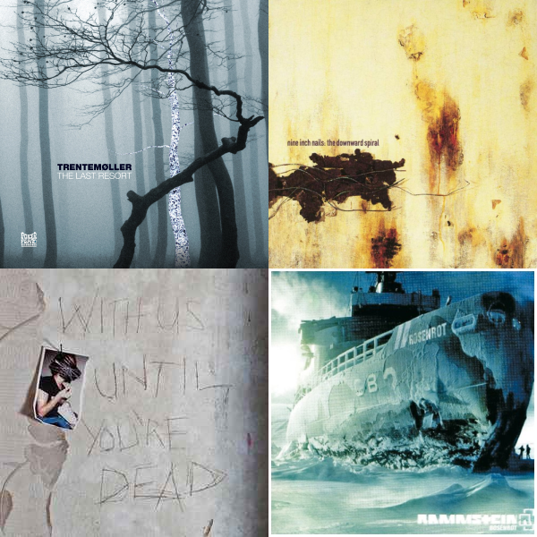

[FR](PASSIONS.md)
### Video Games

As mentioned earlier, video games are both my hobby and my passion.
Despite many prejudices and stereotypes, I believe that video games are much more than just a hobby to unwind after a day. For me, and many others, it is a way to have fun, meet people, express oneself, and learn.

Two significant gaming experiences have shaped me into the person I am today:

The first time I saw my older brother playing: it created a bond between us, and he later introduced me to video games, for which I am grateful every day.
The time my father came back with my first video game, which was just the beginning of this long love affair between me and this vast universe!

I consider myself to have a fairly broad knowledge of this field, which is a plus in my goal of becoming a developer.

### Music

If there's one thing I do besides my daily activities, it's listening to music.
Between commuting every day and my personal time at home, music remains a significant part of my life.

In terms of music styles, I enjoy quite a variety:
- Electronic music
- Metal (power/symphonic/industrial)
- Pop-rock
- ... and probably many more!

As for artists:

- Trentemøller
- Rammstein
- Nine Inch Nails
- Archive
- ... and many others!

### What's next?
[Who am I ?](README.md) 
[My skills](SKILLS.md) 
[My projetcs](PROJECTS.md)
