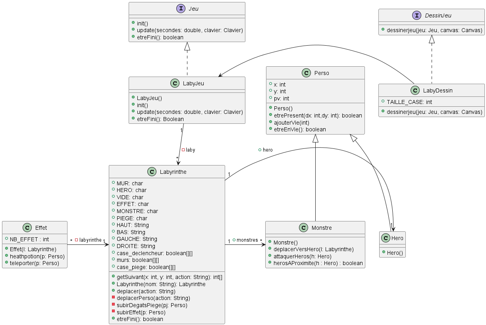

[FR](PROJETS.md)
# 1st Year
### Implementation of a Client Requirement
The aim of this project was to design a small game inspired by Timeline. It was supposed to consist of a timeline with events to be placed in the correct order.

It was done in pairs; I was in charge of the design part, while my colleague took care of testing.

### Development of an Application
The goal of this project was to design and improve a small game, in iterations of 4 hours, with a strong emphasis on the design aspect (class diagram, sequence diagram, testing, group organization, strategy, etc.).

It was done in groups of 4; we divided the work into pairs (each pair had to choose two features, each pair took one and carried out its design, implementation, and verification).

### Comparison of Algorithmic Approaches
This project aimed to encourage us to compare algorithms. I had to compare two implementations of lists (linked lists and contiguous lists) to see which one performed better for certain operations and quantities.

It was done in pairs, and I mainly worked on the final output and the implementation of the two types of lists (the work was done with my partner!).

### Network and Server Application
In this project, we had to create a "pseudo-bash" on Linux, which is a command interpreter. We had to create it in C, along with a video demonstrating how it works. In a second part, we saw how the deployment (at least, between two local machines) of a .deb package, created by us, containing our "pseudo-bash" was done.

It was done by two people; my partner took care of most of the application development, while I handled the package's security (with encrypted keys) and its deployment.

# 2nd Year
### Creation of a PHP Website (NetVOD)
Project done by 4 members, creating a website in PHP similar to Netflix, aiming to understand how the language works.

Handling passwords, database management (PDO), and the implementation of videos and CSS in a PHP website were covered.

### Creation of a Java Introspection Application
Project done by 4 members, creating an application that uses the Java class introspection mechanism to recreate a program similar to the one included in Eclipse for class diagram generation.

### Internship
As an intern, I was assigned several tasks to enhance the company's IT infrastructure. I began by installing GLPI/OCS Inventory, a tool for managing tickets and inventorying IT equipment. I also configured OCS to monitor network devices and detect any anomalies. This installation allowed me to better understand the organization of the IT environment and facilitate the resolution of issues encountered by users.

Next, I used Zabbix to monitor the network's real-time status, creating alerts for common issues and automating certain processes to improve team responsiveness. Through this proactive monitoring, we could detect some problems before they impacted, thus avoiding downtime and data loss.

In parallel, I was also tasked with cleaning up the Active Directory, the Windows solution for network administration. I identified and removed old inactive user accounts, obsolete machines, and permissions, enhancing network security and stability. This experience also provided me with a deep understanding of Active Directory and its functionalities.

I had the opportunity to familiarize myself with Proxmox by using an old ESXi. This experience introduced me to a new virtualization platform and helped me better understand the advantages and limitations of different solutions available on the market.

Finally, I participated in setting up new servers to replace the old installation, which showed signs of failure. With the assistance of Mr. HENZLER, I configured the new servers and migrated critical data, ensuring minimal disruptions for users. This successful migration improved infrastructure performance and capacity while ensuring business continuity. Overall, this assignment allowed me to acquire advanced technical skills and develop my ability to work in a team and solve complex problems in a demanding professional environment.

# 3rd Year
### Administration of a Web Server
Project done by 3 members, the goal was to set up several services (Keycloak, Nextcloud, Lstu, Oauth2, and OpenLDAP), all on an Nginx server.

The aim was to see how these services communicated securely with each other and to manage authentication with an LDAP server.

### Supervised Project: Monitoring and Log File Analysis Solution
Ongoing project with 4 members. We have to set up 2 Docker clusters, one for monitoring and the other for services to be monitored.

We are using several monitoring solutions:
- Grafana
- Prometheus
- cAdvisor

And several log file analysis solutions:
- Elasticsearch
- Kibana
- Filebeat

The goal is to send all errors in the logs to a language model to process the error and provide us with the solution, thanks to a Python program.

### What's next?
[Who am I ?](README.md) 
[My skills](SKILLS.md) 
[My passions](PASSIONS_EN.md)
