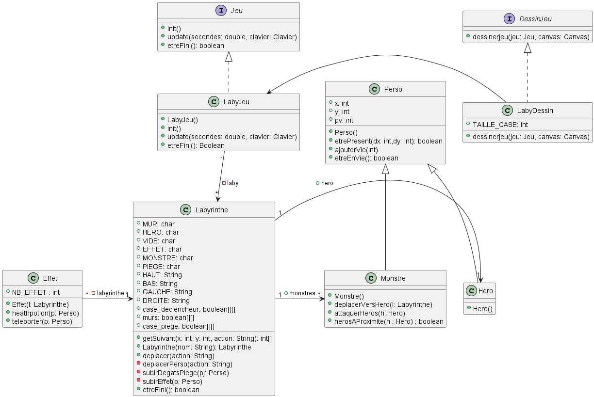

# 1ère année
### Implémentation d'un besoin client
Le but de ce projet était de concevoir un petit jeu inspiré de Timeline. Il devait être constitué d'une frise chronologique avec des événements à placer dans le bon ordre.

Elle a été réalisé en binôme, je m'occupais de la partie conception, tandis que mon collègue s'occupait plutôt des tests.

### Développement d'une application
Le but de ce projet était de concevoir et d'améliorer un petit jeu, sous formes d'itérations de 4h, avec comme intérêt principal une forte mise en avant sur le côté conception (diagramme de classe, de séquences, test, organisation en groupe, stratégie, ...).

Elle a été réalisé par groupe de 4, nous nous repartissions le travail en binôme (sachant que nous devions choisir deux fonctionnalités, chacun des binômes en prenait une, et réalisait sa conception, son implémentation et sa vérification).

### Comparaison d'approches algorithmiques
Ce projet avait pour but de nous inciter dans la démarche de comparaison d'algorithmes. J'ai du comparé deux implémentations de listes (les listes chaînées et les listes contigües), afin de voir laquelle performait mieux pour telle opération et telle quantité.

Elle a été réalisé en binôme, et je me suis principalement occupé du rendu final et de l'implémentation des deux types de listes (le travail a été réalisé avec mon camarade !).

### Réseau et application serveur
Lors de ce projet, nous avons dû réaliser un "pseudo-bash" sur Linux, c'est un interpréteur de commande. Nous avons dû réaliser sa création, en C, ainsi qu'une vidéo montrant comment il fonctionne. Dans une seconde partie, nous avons pu voir comment se passait la mise en ligne (du moins, entre deux machines locales) d'un paquet .deb, réalisé par nos soins, contenant notre "pseudo-bash".

Elle s'est déroulée à deux, mon camarade s'est occupé de la majeure partie du développement de l'application, tandis que je me suis occupé de la sécurisation du paquet (avec des clés chiffrées), et de son déploiement.

# 2ème année
### Création d'un site web PHP (NetVOD)
Projet réalisé à 4, création d'un site web en PHP style Netflix, le but était de voir comment fonctionnait le langage.

La gestion des mots de passe, de la base de données (PDO), et l'implémentation de vidéos et du CSS dans un site en PHP a été vu.

### Création d'une application d'introspection Java
Projet réalisé à 4, création d'une application qui utilise le mécanisme d'introspection des classes de Java afin de récréer un programme semblable à celui inclus dans Eclipse pour la réalisation de diagramme de classe.

# 3ème année
### Administration d'un serveur Web
Projet réalisé à 3, le but était de mettre en place plusieurs services (Keycloak, Nextcloud, Lstu, Oauth2 et OpenLDAP), le tout sur un serveur Nginx.

Le but était de voir comment ces services communiquaient de façon sécurisée entre eux, et de gérer l'authentification avec un serveur LDAP.

### Projet tutoré : solution de monitoring et analyse de fichiers journaux
Projet actuellement en cours, à 4. Nous devons mettre en place 2 clusters Docker, l'un de monitoring, l'autre de services à surveiller.

Nous utilisons plusieurs solutions de surveillance :
- Grafana
- Prometheus
- cAdvisor

Et plusieurs solutions d'analyse de fichiers journaux :
- Elasticsearch
- Kibana
- Filebeat

Le but est d'envoyer toutes les erreurs dans les journaux à un modèle de langage afin de traiter l'erreur et de nous rendre la solution, grâce à un programme Python.

### Et ensuite ?

[Qui suis-je ?](LISEZMOI.md) 
[Mes compétences](COMPETENCES.md) 
[Mes passions](PASSIONS.md)
